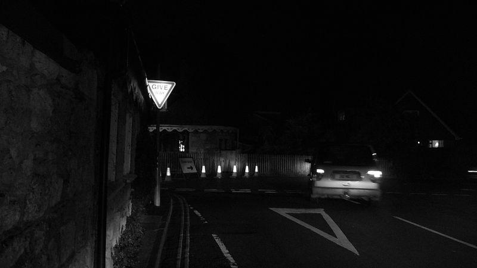
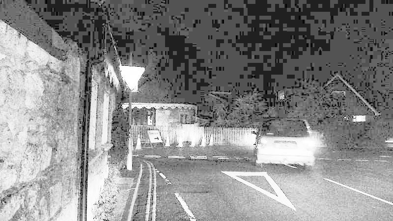
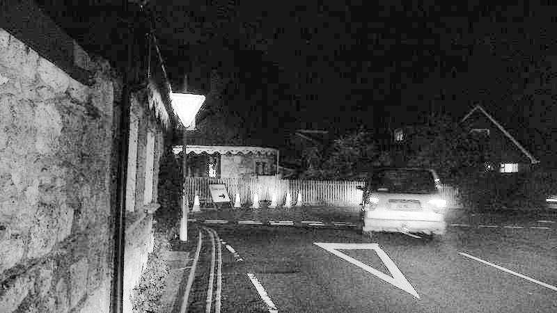

# image-enhancement
  直方图均衡化和改进直方图均衡化  ：
  由于直方图均衡化的方法对所有像素一视同仁，这一方面不符合人类的视觉认知，另一方面，它可能增加了具有很多像素值的噪声的对比度，同时减少了具有较少像素值的   有用信号的对比度，为了解决这个问题，论文中提出了一种倾向增强有用信号的对比度，同时衰减对于视觉不太重要的对比度的方法。论文中解决方法的思路是：一般来     说：对于视觉重要的像素通常和邻域像素的灰度值有较大的不同，同时在自然场景中一般来说重要的信息更多的存在于较暗的像素中而非较亮的像素中，因此论文提出了一   种描述像素灰度值重要性的方法:dark-pass filter gradients， 并通过像素金字塔的方法进行了求解，得出了很好的效果  
  
  
  1.原始图片    
    
  2.传统直方图均衡化  
    
  3.改进直方图均衡化  
    
  [参考文献](Contrast-accumulated histogram equalization for image enhancement)
